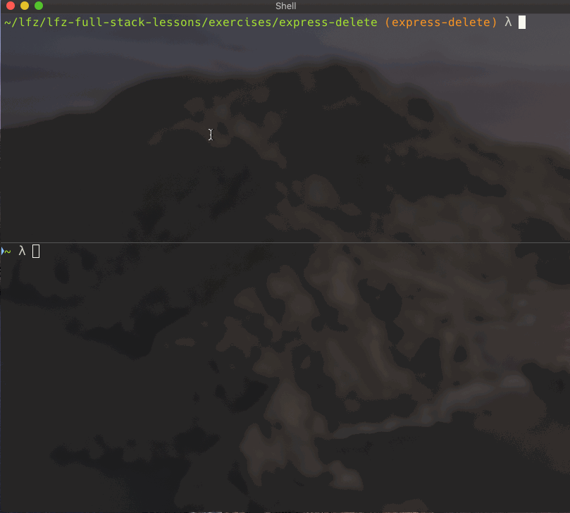

# express-delete

This lesson covers programming an Express server to handle `DELETE` requests.

### Before You Begin

Be sure to check out a new branch (from `master`) for this exercise. Detailed instructions can be found [**here**](../../guides/before-each-exercise.md). Then navigate to the `exercises/express-delete` directory in your terminal.

### Exercise

1. Set up a basic Express `app`.
1. Create an array of a few (two is fine) grade objects that include, `id`, `name`, `course`, and `grade` properties.
1. Review [basic routing](https://expressjs.com/en/starter/basic-routing.html) in the Express docs.
1. Add a route to your `app` that responds to `GET` requests at `/api/grades` and uses [`res.json()`](https://expressjs.com/en/4x/api.html#res.json) to send the array of grades back to the client.
1. Read the introductory section of [Routing](https://expressjs.com/en/guide/routing.html) in the Express docs.
1. Read about [route parameters](https://expressjs.com/en/guide/routing.html#route-parameters) in the Express docs. Do the reading but look closely at this part:
    ```bash
    Route path: /users/:userId/books/:bookId
    Request URL: http://localhost:3000/users/34/books/8989
    req.params: { "userId": "34", "bookId": "8989" }
    ```
1. Add a route to your `app` that responds to `DELETE` requests at `/api/grades/:id`. In your callback, `req.params.id` will be the _real_ `id` the client specified in the request target. For example if they try to delete `/api/grades/2`.
1. Remove the matching grade object from your array of grades and respond to the client with a status code of `204` using [`res.sendStatus()`](https://expressjs.com/en/4x/api.html#res.sendStatus).
1. Test your server with HTTPie.

<p align="middle">
  
</p>

### Submitting Your Solution

When your solution is complete, return to the root of your `lfz-full-stack-lessons` directory. Then commit your changes, push, and submit a Pull Request on GitHub. Detailed instructions can be found [**here**](../../guides/after-each-exercise.md).
