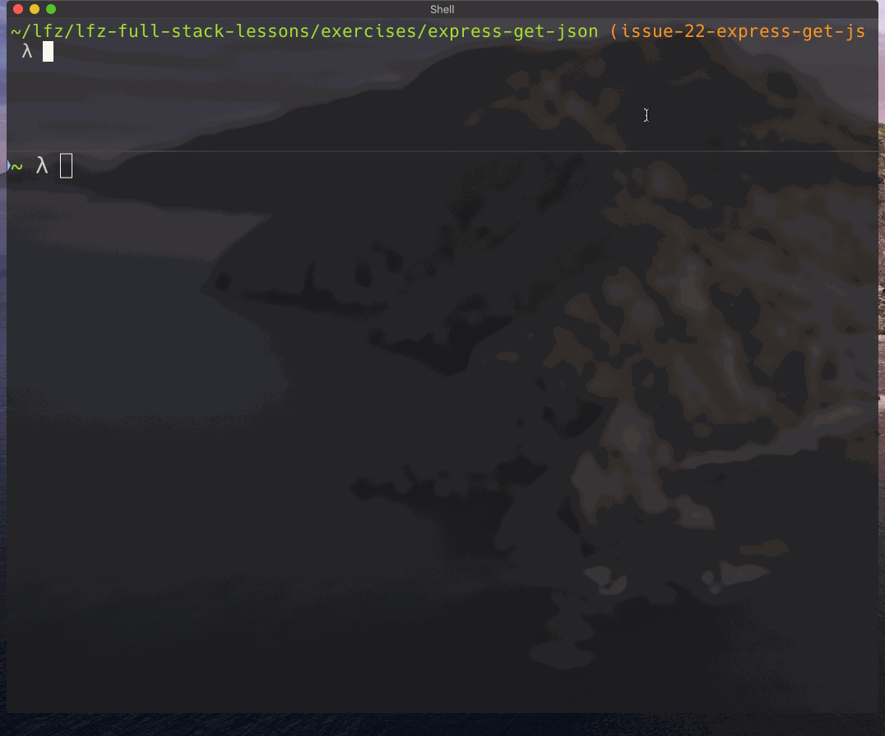

# express-get-json

This lesson covers setting up an Express web server to provide data to client applications.

### Before You Begin

Be sure to check out a new branch (from `master`) for this exercise. Detailed instructions can be found [**here**](../../guides/before-each-exercise.md). Then navigate to the `exercises/express-get-json` directory in your terminal.

### Exercise

1. Create an `index.js` containing basic Express server with no functionality.
1. Near the top of `index.js` (after you require `'express'`), create an array of objects, each with `id`, `name`, `course`, and `grade` properties. Two is fine, they just need to be in an array.
    ```js
    {
      id: 1,
      name: 'Beeg Yoshi',
      course: 'Meming',
      grade: 9001
    }
    ```
1. Read about [basic routing](http://expressjs.com/en/guide/routing.html) in the Express documentation.
1. Read about the [`json()` method](http://expressjs.com/en/4x/api.html#res.json) of the Express `res` object in the Express documentation.
1. Enhance your Express `app` to handle `GET` requests at the path `'/api/grades'` by responding with the array of grade objects in JSON format.
1. Test your server with HTTPie by sending a `GET` request to `localhost:3000/api/grades`.
1. Test your server by visiting `http://localhost:3000/api/grades` in your web browser.

<p align="middle">
  
</p>

### Extra - DON'T DO BEFORE TURNING IN THE ABOVE

1. Add a `public/` directory containing an `index.html` and a `main.js`
1. Link your `main.js` to `index.html` with a script tag and add jQuery from a CDN.
1. Enhance your Express `app` to serve files from the `public/` directory using [`express.static()`](../express-static/README.md).
1. In `main.js` use `$.ajax()` to fetch data from your server at `/api/grades`.
1. Load your web site at `http://localhost:3000` in your web browser.
1. Confirm that everything is working using the "Network" tab of the Developer Tools.

### Submitting Your Solution

When your solution is complete, return to the root of your `lfz-full-stack-lessons` directory. Then commit your changes, push, and submit a Pull Request on GitHub. Detailed instructions can be found [**here**](../../guides/after-each-exercise.md).

### Quiz

- What is the appropriate `Content-Type` header for requests and responses that contain JSON in their body?
