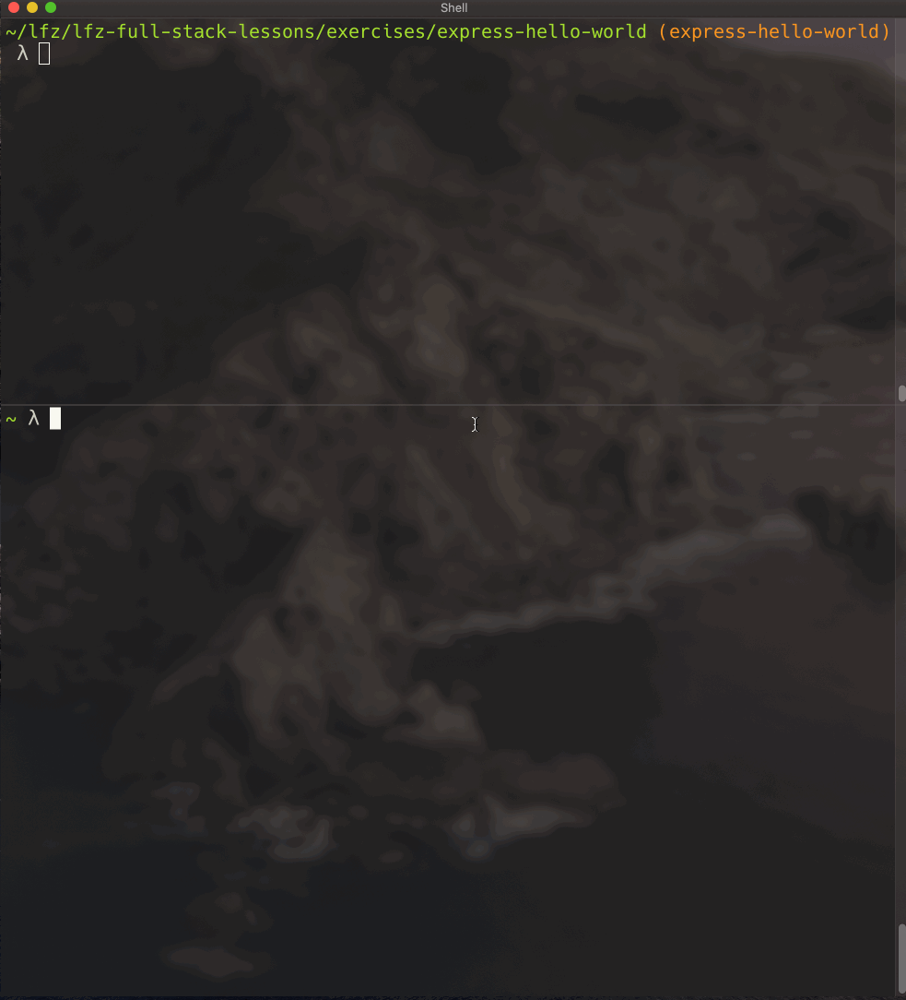

# express-hello-world

This lesson covers programming an Express server to respond to client requests.

### Before You Begin

Be sure to check out a new branch (from `master`) for this exercise. Detailed instructions can be found [**here**](../../guides/before-each-exercise.md). Then navigate to the `exercises/express-hello-world` directory in your terminal.

### Exercise

1. Initialize your solution with a new `package.json` using the `npm init` command.
1. Use `npm install` to add `express` as a dependency.
1. Create a new file named `index.js` and within it:
    - `require()` the `express` function exported from the `'express'` package.
    - create a new Express application object by calling the `express` function.
1. Read about [Using Middleware](https://expressjs.com/en/guide/using-middleware.html) through the **first** code example in the official Express documentation.
    ```js
    var app = express();

    app.use(function (req, res, next) {
      console.log('Time:', Date.now());
      next();
    });
    ```
1. Read about [the `use()` method](https://expressjs.com/en/4x/api.html#app.use) of Express application objects.
1. Call the `use()` method of your `app` object and pass it a callback function with two parameters:
    - `req` (short for "request")
    - `res` (short for "response")
1. Read about [the `method` property](https://expressjs.com/en/4x/api.html#req.method) of the Express `req` object.
1. Within your callback function, log the `method` property of the `req` object.
1. Read about [the `send()` method](https://expressjs.com/en/4x/api.html#res.send) of the Express `res` object.
1. Within your callback function, call the `send()` method of the `res` object and pass it a string.
1. At the bottom of `index.js`, call [the `listen()` method](https://expressjs.com/en/4x/api.html#app.listen) of your `app` object and pass it the port number `3000` as well as a callback that prints a confirmation that the server is listening.
1. Start your server by executing `index.js` with the `node` command.
1. In a separate terminal session, use the `http` command to send a `GET` request to `localhost:3000` to confirm that your server is working as expected.
1. Visit `http://localhost:3000` in your web browser. You should receive the same response.

<p align="middle">
  
</p>

### Extra

- Try sending HTTP requests with different methods (`GET`, `POST`, `DELETE`) to `localhost:3000` to see the different methods being logged to your server terminal.
- Try sending an HTML string from your server and visiting `http://localhost:3000` in your browser.

### Submitting Your Solution

When your solution is complete, return to the root of your `lfz-full-stack-lessons` directory. Then commit your changes, push, and submit a Pull Request on GitHub. Detailed instructions can be found [**here**](../../guides/after-each-exercise.md).

### Quiz

- How do you register a middleware with an Express application?
- Which objects does an Express application pass to your middleware to manage the request/response lifecycle of the server?
