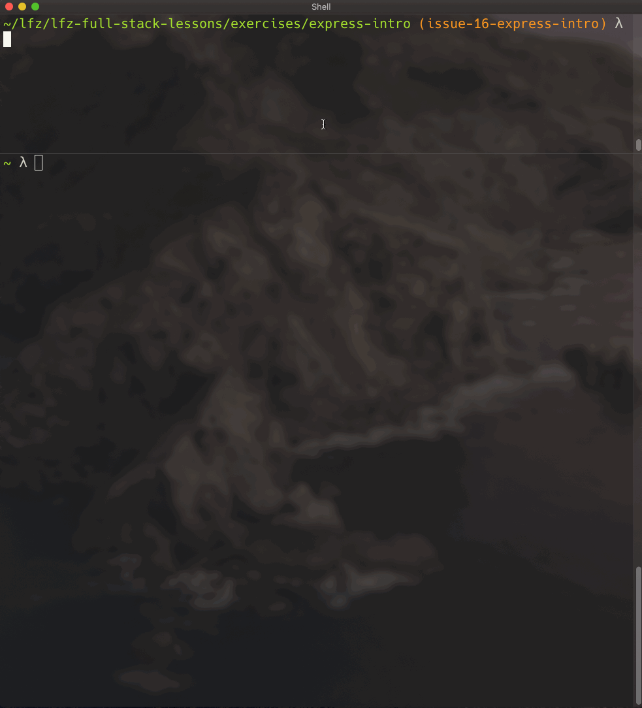

# express-intro

This lesson introduces the Express web framework for Node.js.

### Before You Begin

Be sure to check out a new branch (from `master`) for this exercise. Detailed instructions can be found [**here**](../../guides/before-each-exercise.md). Then navigate to the `exercises/express-intro` directory in your terminal.

### Introduction

Express.js is an extremely popular and widely deployed web server framework for Node.js, known for its simplicity and ease of use.

### Exercise

1. Read about Express.js on the [expressjs.com](https://expressjs.com) home page.
1. Create a new `package.json` for this exercise with the `npm init` command.
1. Use `npm` to install [the `express` package](https://www.npmjs.com/package/express) from the NPM registry.
1. Verify that `express` was added to your `package.json` dependencies.
1. Verify that it was downloaded into your local `node_modules/` directory.
1. Bookmark the official [Express.js 4 Documentation](https://expressjs.com/en/4x/api.html).
1. Create a new file named `index.js` and within it:
    - `require()` the `express` function exported from the `'express'` package.
    - Create a new Express application object by calling the `express()` function.
1. Read about [the `listen()` method](https://expressjs.com/en/4x/api.html#app.listen) of Express application object.
1. Call the `listen()` method of your application object and pass it the port `3000`, and a callback that logs a message indicating that the server is listening like this:
    ```js
    app.listen(3000, () => {
      // eslint-disable-next-line no-console
      console.log('Express server listening on port 3000');
    });
    ```
1. Start your server by executing `index.js` with the `node` command. You can stop it at any time by pressing `Ctrl + C`.
1. In a separate terminal session, use the `top` command to confirm that a `node` process is running.
1. [Use the `http` command to issue a `GET` request to `localhost:3000`](https://httpie.org/doc#examples).
    - **It doesn't matter what directory you're in when you send the `GET` request.**
    - **You should receive a 404 Not Found response from the server.**
1. Visit `http://localhost:3000` in your web browser. You should receive the same response.


<p align="middle">
  
</p>

### Submitting Your Solution

When your solution is complete, return to the root of your `lfz-full-stack-lessons` directory. Then commit your changes, push, and submit a Pull Request on GitHub. Detailed instructions can be found [**here**](../../guides/after-each-exercise.md).

### Quiz

- How do you add `express` to your package dependencies?
- What Express application method binds the application to a network `PORT`?
