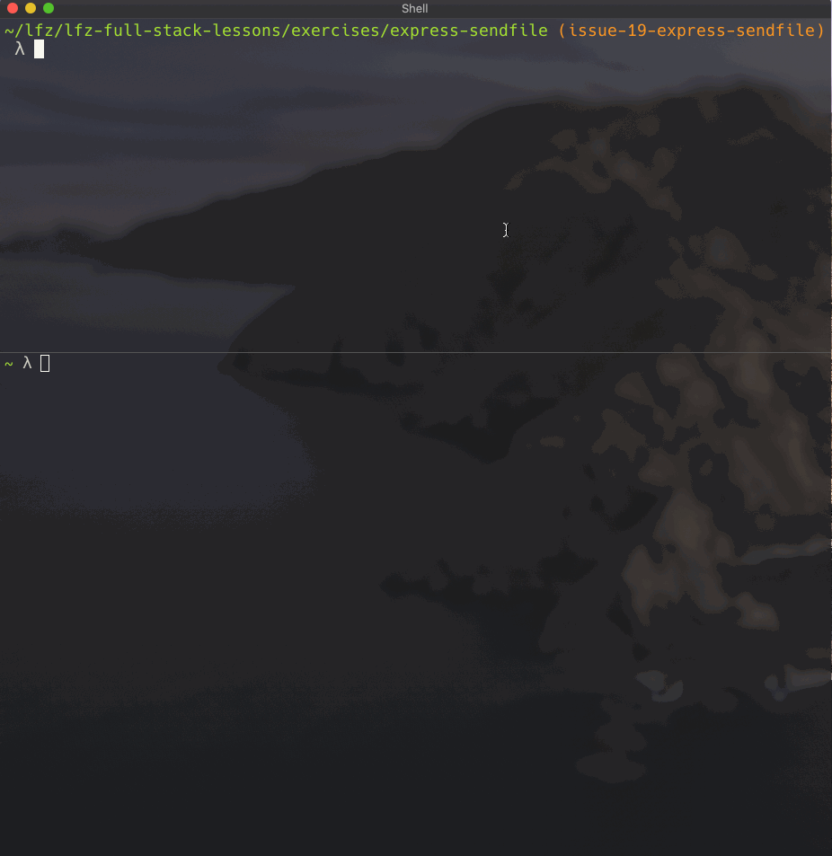

# express-sendfile

This lesson covers one of the ways that an express server can send file contents in response to client requests.

### Before You Begin

Be sure to check out a new branch (from `master`) for this exercise. Detailed instructions can be found [**here**](../../guides/before-each-exercise.md). Then navigate to the `exercises/express-sendfile` directory in your terminal.

### Exercise

1. Initialize your solution with a new `package.json`.
1. Install `express` as a dependency.
1. Create and `index.js` file and within it:
    - `require()` the `express` function from the `'express'` package.
    - Instantiate an Express `app` object.
1. Create three files: `index.html`, `styles.css`, and `main.js` and link your CSS and JavaScript to your HTML file (using `<link href="/styles.css">` and `<script src="/main.js">` tags **NOTE THE FORWARD SLASH**).
1. Register a middleware callback with [the `use()` method](https://expressjs.com/en/4x/api.html#app.use) of the Express `app` object. The callback should take a `req`, `res`, and `next` as parameters.
1. Read about [the `originalUrl` property](https://expressjs.com/en/4x/api.html#req.originalUrl) of the Express `req` object.
1. Read about [the `sendFile()` method](https://expressjs.com/en/4x/api.html#res.sendFile) of the Express `res` object. Be sure to pass an options object `{ root: __dirname }`.
1. Within your callback, use `res.sendFile()` to send one of your files (`index.html`, `styles.css`, or `main.js`) if the `req.originalUrl` is `/index.html`, `/styles.css`, or `/main.js` respectively. **If none of these are matched, call the `next()` function instead to trigger a 404 Not Found response**.
1. Add [`app.listen()`](https://expressjs.com/en/4x/api.html#app.listen) to the bottom of `index.js` so that your server listens on port `3000`.
1. Start your server by executing `index.js` with the `node` command.
1. Test your server using the `http` command to send `GET` requests for `localhost:3000/index.html`, `localhost:3000/styles.css`, and `localhost:3000/main.js` one-by-one.
1. Test your server by visiting `http://localhost:3000/index.html` in your web browser and checking the "Network" tab of the developer tools.

  

### Submitting Your Solution

When your solution is complete, return to the root of your `lfz-full-stack-lessons` directory. Then commit your changes, push, and submit a Pull Request on GitHub. Detailed instructions can be found [**here**](../../guides/after-each-exercise.md).

### Quiz

- What is the `Content-Type` header of HTTP requests and responses used for?
