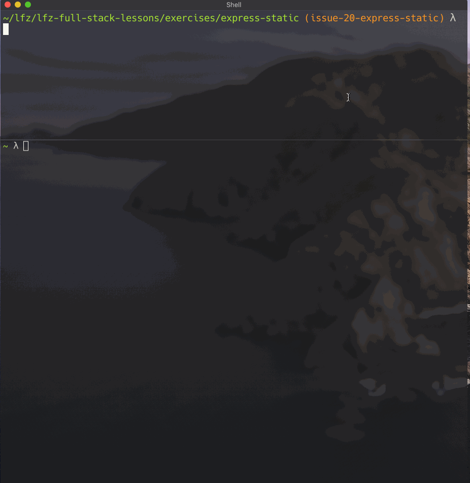

# express-static

This lesson covers a built-in middleware bundled with Express to make serving files easy.

### Before You Begin

Be sure to check out a new branch (from `master`) for this exercise. Detailed instructions can be found [**here**](../../guides/before-each-exercise.md). Then navigate to the `exercises/express-static` directory in your terminal.

### Exercise

1. Initialize your solution with a `package.json` and install `express` as a dependency.
1. Create an `index.js` to hold your server code.
1. Create a `public/` directory and within it create:
    - an `index.html`
    - a `styles.css`
    - a `main.js`
1. Link your CSS and JavaScript to your HTML file. The paths should be `/styles.css` and `/main.js` respectively.
1. Read about [Express static middleware](https://expressjs.com/en/4x/api.html#express.static) in the Express documentation.
1. Read about [Serving static files in Express](http://expressjs.com/en/starter/static-files.html). Note the tip at the end.
1. Review [what `__dirname` is](https://nodejs.org/docs/latest-v10.x/api/modules.html#modules_dirname) in the official Node.js documentation.
1. Read about the [`join()` method of Node's built-in `path` module](https://nodejs.org/docs/latest-v10.x/api/path.html#path_path_join_paths) in the official Node.js documentation.
1. In `index.js`, `require()` both `express` and Node's `path` module.
1. Create a basic Express app object in `index.js`.
1. Use [`path.join()`](https://nodejs.org/docs/latest-v10.x/api/path.html#path_path_join_paths) to combine `__dirname` and your `public` directory's name (`'public'`) into the absolute path to your `public` directory. Put the return value into a variable. You can always log it if you're curious about the value.
1. Use [`express.static()`](https://expressjs.com/en/4x/api.html#express.static) to create a middleware function that will automatically serve any files located in your `public` directory. Put the return value into a variable.
1. Register the middleware you just created with the [`app.use()`](https://expressjs.com/en/4x/api.html#app.use)
1. Listen on port `3000`.
1. Start your server with `node`.
1. Test your server by sending `GET` requests to `localhost:3000` with HTTPie.
1. Test your server by visiting `http://localhost:3000` in your browser and checking the "Network" tab of the developer tools.

  

### Extra

- Try downloading some images from the internet and putting them in your `public` directory. Does your server serve them?
- Try embedding your images in your HTML and verify that they load.

### Submitting Your Solution

When your solution is complete, return to the root of your `lfz-full-stack-lessons` directory. Then commit your changes, push, and submit a Pull Request on GitHub. Detailed instructions can be found [**here**](../../guides/after-each-exercise.md).

### Quiz

-
