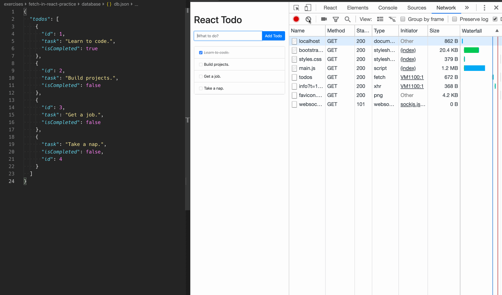

# fetch-in-react-practice

Practice sending HTTP requests to a server from a React app.

### Before You Begin

Be sure to check out a new branch (from `master`) for this exercise. Detailed instructions can be found [**here**](../../guides/before-each-exercise.md). Then navigate to the `exercises/fetch-in-react-practice` directory in your terminal.

### Exercise

1. Read through all of the provided code, including `package.json` and `webpack.config.js`.
1. Install all dependencies with `npm install`.
1. Run the `"dev"` script to start the JSON server and Webpack Dev Server. Then visit `localhost:3000` in your browser.
1. Complete the implementation of the `App` component in `client/components/app.jsx` to perform HTTP requests to the server API.

### TIP

Use the **Network** tab of your Developer Tools to inspect your requests and their responses.

### TIP

[Install the React Dev Tools](https://chrome.google.com/webstore/detail/react-developer-tools/fmkadmapgofadopljbjfkapdkoienihi?hl=en) for your browser to add a **React** tab to the Developer Tools.

### API Documentation

#### `GET /api/todos`

Returns a JSON Array of all `todo` objects from `db.json`.

#### `POST /api/todos`

Creates a new `todo` object from the request body and returns the created `todo`, including an auto-generated `id` property.

#### `PATCH /api/todos/${todoId}`

Applies updates to the `todo` object identified by its `id` property in the URL and applies the updates found in the request body. Returns the updated `todo`.

### Submitting Your Solution

When your solution is complete, return to the root of your `lfz-full-stack-lessons` directory. Then commit your changes, push, and submit a Pull Request on GitHub. Detailed instructions can be found [**here**](../../guides/after-each-exercise.md).
