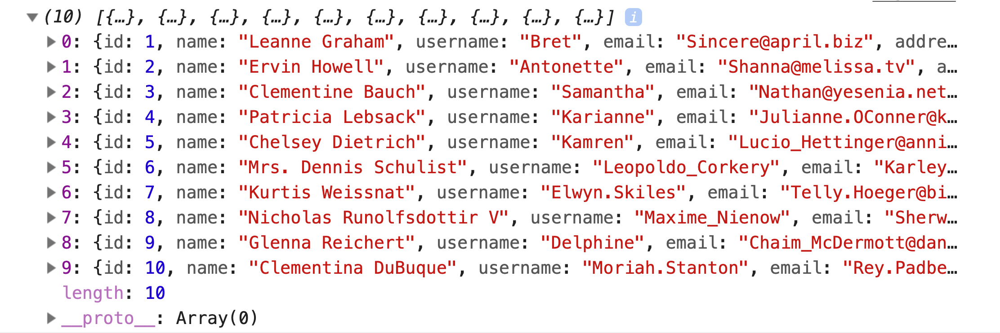

# fetch

Using `fetch` to send HTTP requests from the browser.

### Before You Begin

Be sure to check out a new branch (from `master`) for this exercise. Detailed instructions can be found [**here**](../../guides/before-each-exercise.md). Then navigate to the `exercises/fetch` directory in your terminal.

### Exercise

1. Read about [`fetch`](https://developer.mozilla.org/en-US/docs/Web/API/Fetch_API/Using_Fetch) in the MDN Web Docs.
1. Briefly review the [syntax and return value](https://developer.mozilla.org/en-US/docs/Web/API/WindowOrWorkerGlobalScope/fetch#Syntax) of calling `fetch` in the MDN Web Docs.
1. Briefly review the [syntax and return value](https://developer.mozilla.org/en-US/docs/Web/API/Body/json) of the `json()` method found on `fetch` responses.
1. Add an HTML skeleton to `index.html` including a script tag for `main.js`.
1. Within `main.js`, use `fetch` to send a `GET` request to `https://jsonplaceholder.typicode.com/users`, and log the `Array` of user objects to the console.
1. **Alternatively**, use `fetch` to send a `GET` request to [the PokéAPI](https://pokeapi.co/docs/v2.html#pokemon) to retrieve your favorite pokémon and log its data to the console. *e.g* `https://pokeapi.co/api/v2/pokemon/1`

### Submitting Your Solution

When your solution is complete, return to the root of your `lfz-full-stack-lessons` directory. Then commit your changes, push, and submit a Pull Request on GitHub. Detailed instructions can be found [**here**](../../guides/after-each-exercise.md).

### Quiz

- What does `fetch()` return?
- What is the default request method used by `fetch()`?
- How do you specify the request method (`GET`, `POST`, etc.) when calling `fetch`?
