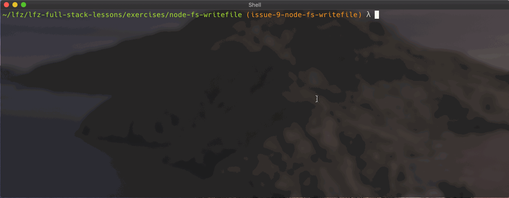
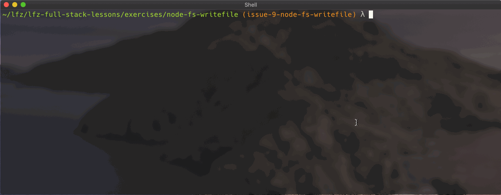

# node-fs-writefile

This exercise expands on use of the `fs` Node.js module after its introduction in `node-fs-readfile`.

### Before You Begin

Be sure to check out a new branch (from `master`) for this exercise. Detailed instructions can be found [**here**](../../guides/before-each-exercise.md). Then navigate to the `exercises/node-fs-writefile` directory in your terminal.

### Exercise

#### Level 1

1. Read about [`fs.writeFile`](https://nodejs.org/docs/latest-v10.x/api/fs.html#fs_fs_writefile_file_data_options_callback) in the official Node.js documentation.
1. Create a new file named `write-rand.js`.
1. Within `write-rand.js`, use `fs.writeFile` to write a random number to a new file named `random.txt`.
1. Execute `write-rand.js` with the `node` command. A new, random number should be written to `random.txt` each time you execute `write-rand.js`.

  

#### Level 2

1. Create a new file named `note-to-self.js`.
1. Within `note-to-self.js`, use `fs.writeFile` and `process.argv` to accept input from the user to write to a new file named `note.txt`.
1. After executing `note-to-self.js`, verify the contents of `note.txt`.

  

#### Level 3 - DO AFTER TURNING IN LEVELS 2 AND 3

1. Create a new file named `cp.js`.
1. Within `cp.js`, use `fs.readFile`, `fs.writeFile`, and `process.argv` to copy one file to another file.

  

### Submitting Your Solution

When your solution is complete, return to the root of your `lfz-full-stack-lessons` directory. Then commit your changes, push, and submit a Pull Request on GitHub. Detailed instructions can be found [**here**](../../guides/after-each-exercise.md).

### Quiz

- What method is available in the Node.js `fs` module for writing data to a file?
- Are file operations using the `fs` module synchronous or asynchronous?
