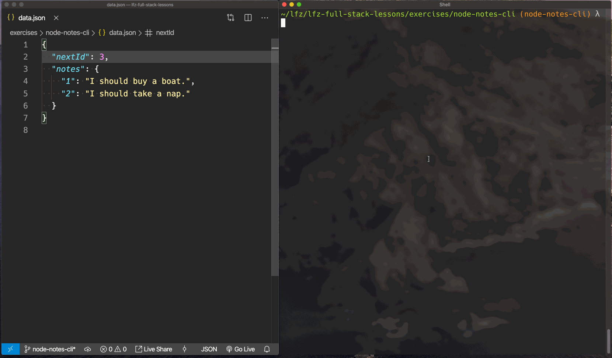

# node-notes-cli

In this lesson you will be writing a small command-line application that allows its users to create, read, update, or delete notes in a JSON file.

### Before You Begin

Be sure to check out a new branch (from `master`) for this exercise. Detailed instructions can be found [**here**](../../guides/before-each-exercise.md). Then navigate to the `exercises/node-notes-cli` directory in your terminal.

### Challenge

The features for this application are as follows:

1. **User can read their notes:** asking the program to `read` should display all notes in the `data.json` file.
1. **User can add a note:** giving the program a new note should append the note to the list of notes in the `data.json` file.
1. **User can delete a note:** the user should be able to ask the program to `delete` a note by its `id`
1. **User can update a note:** the user should be able to replace the content of a note given its `id` and the new `content`.

Each of these operations will involve some mixture of reading the `data.json` file, parsing it into JavaScript objects, possibly modifying the data, serializing it back into a JSON string, and then writing the JSON string back into `data.json`.

### Tips

- If you `require()` a `.json` file, Node's module system will automatically parse its contents into JavaScript objects.
- Use `JSON.stringify(data, null, 2)` to create a JSON string with nice indentation and formatting before writing it back to `data.json`.

### Demo

  

### Submitting Your Solution

When your solution is complete, return to the root of your `lfz-full-stack-lessons` directory. Then commit your changes, push, and submit a Pull Request on GitHub. Detailed instructions can be found [**here**](../../guides/after-each-exercise.md).
