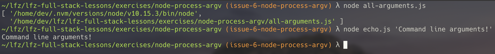

# node-process-argv

This exercise goes a little deeper into how node programs are simply running processes on your computer. You'll be learning about a very important global variable present in all Node.js programs. In particular, you'll be learning how to handle command-line arguments from within your JavaScript code.

### Before You Begin

Be sure to check out a new branch (from `master`) for this exercise. Detailed instructions can be found [**here**](../../guides/before-each-exercise.md). Then navigate to the `exercises/node-process-argv` directory in your terminal.

### Exercise

1. Visit the [`Process`](https://nodejs.org/docs/latest-v10.x/api/process.html) documentation in the official Node.js documentation (for version 10) and skim through the list of properties that exist on the global `process` object. Read the first sentence describing the `process` object.
1. Within `process.js`, use `console.log()` to print the entire `process` object to the terminal.
1. Test your code by executing `process.js` with the `node` command.
1. Read about [`process.argv`](https://nodejs.org/docs/latest-v10.x/api/process.html#process_process_argv) in the official Node.js documentation.
1. Within `all-arguments.js` use `console.log()` to print the `.argv` property of the `process` object to the terminal.
1. Test your code by executing `all-arguments.js` with the `node` command.
1. Within `echo.js` only print the message that the user types when executing your program with node.
1. Test your code by executing `echo.js` with the `node` command.

  

### Submitting Your Solution

When your solution is complete, return to the root of your `lfz-full-stack-lessons` directory. Then commit your changes, push, and submit a Pull Request on GitHub. Detailed instructions can be found [**here**](../../guides/after-each-exercise.md).

### Quiz

- What is the `process` in a Node.js program?
- How do you access `process` in a Node.js program?
- What is the data type of `process.argv` in Node.js?
