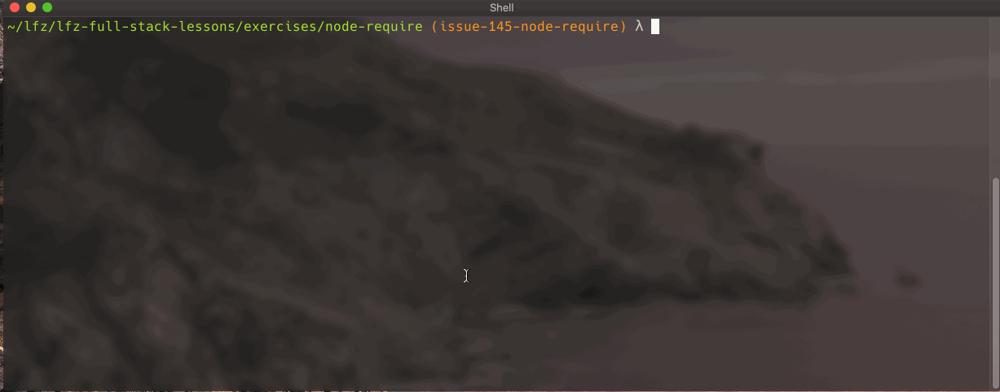

# node-require

This lesson expands on `node-module-system` to explore using the `module` object and `require` function to build a small Node.js program made of multiple "modules".

### Before You Begin

Be sure to check out a new branch (from `master`) for this exercise. Detailed instructions can be found [**here**](../../guides/before-each-exercise.md). Then navigate to the `exercises/node-require` directory in your terminal.

### Introduction

In this exercise you'll be building a basic command-line calculator application supporting simple addition, subtraction, multiplication and division operations.

<p align="middle">
  
</p>

### Exercise

1. Create four files: `add.js`, `subtract.js`, `multiply.js`, and `divide.js`.
1. Within each file, define the following functions:
    - in `add.js` define a function with two parameters that returns their sum.
    - in `subtract.js` define a function with two parameters that returns their difference.
    - in `multiply.js` define a function with two parameters that returns their product.
    - in `divide.js` define a function with two parameters that returns their quotient.
1. Within each file, assign the function you defined to the `exports` property of the local `module` object.
1. Within `calculate.js`, call the local `require()` function to import each of the functions defined within `add.js`, `subtract.js`, `multiply.js`, and `divide.js`. For example, to import the `add` function you'l do this:
    ```js
    const add = require('./add');
    ```
    Note that the `.js` file extension is implicit. You can say `'./add.js'`, but the `.js` is not needed. Also note the `.` at the beginning of the path.
1. Complete `calculate.js` to perform some conditional logic based on the values passed to the program via [`process.argv`](https://nodejs.org/docs/latest-v10.x/api/process.html#process_process_argv). As demonstrated in the above GIF, the program is meant to receive a numeric value, followed by an operation, and finally another numeric value.

#### Tips

- Bear in mind that all values passed to your program are of type `String`, so you will need to convert numeric strings to the actual `Number` type.
- Instead of trying to implement all of the logic at once, try getting only one operation to work first, such as adding two numbers.

### Submitting Your Solution

When your solution is complete, return to the root of your `lfz-full-stack-lessons` directory. Then commit your changes, push, and submit a Pull Request on GitHub. Detailed instructions can be found [**here**](../../guides/after-each-exercise.md).

### Quiz

- What is the purpose of `module.exports` in a Node.js module?
- How do you import functionality into a Node.js module from another Node.js module?
