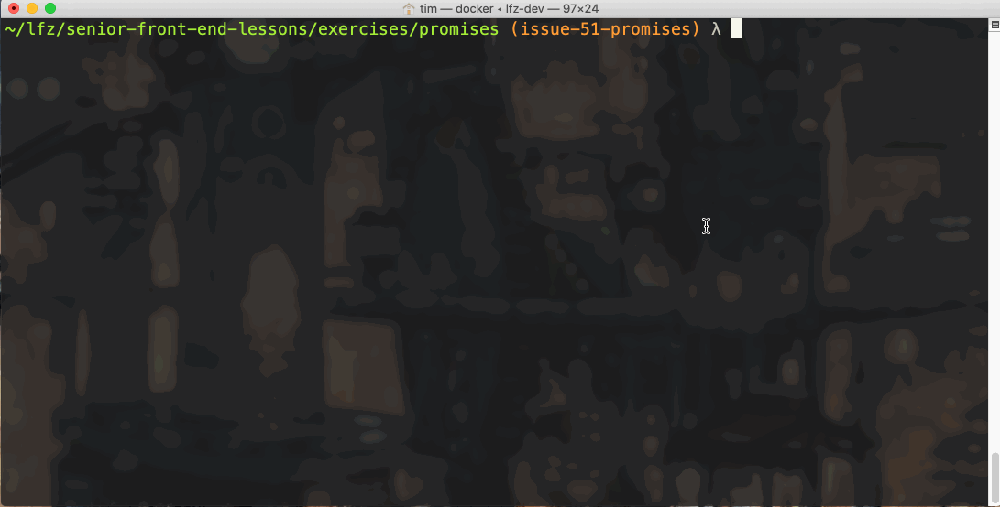

# promises

Working with objects that represent future results.

### Before You Begin

Be sure to check out a new branch (from `master`) for this exercise. Detailed instructions can be found [**here**](../../guides/before-each-exercise.md). Then navigate to the `exercises/promises` directory in your terminal.

### Exercise

1. Read the introductory paragraph and description of [Promises](https://developer.mozilla.org/en-US/docs/Web/JavaScript/Reference/Global_Objects/Promise) in the MDN Web Docs.
1. Read about [`Promise.prototype.then`](https://developer.mozilla.org/en-US/docs/Web/JavaScript/Reference/Global_Objects/Promise/then) in the MDN Web Docs.
1. Read about [`Promise.prototype.catch`](https://developer.mozilla.org/en-US/docs/Web/JavaScript/Reference/Global_Objects/Promise/catch) in the MDN Web Docs.
1. Examine the function definition in `take-a-chance.js`. `takeAChance` takes a `String name` and returns a `Promise` object that will randomly become **fulfilled** or **rejected** after a two second delay.
1. Within `index.js`:
    - call `takeAChance` and pass it your name.
    - store the returned `Promise` object in a variable.
    - add the following handlers to the `Promise` object:
      - one that logs the winning message if the promise becomes fulfilled
      - one that logs the [`error.message`](https://developer.mozilla.org/en-US/docs/Web/JavaScript/Reference/Global_Objects/Error/message) to the console if the promise becomes rejected
1. Test your code with the `node` command.
    ```bash
    node index.js
    ```
1. After you've submitted your solution, watch [Phil Roberts's presentation](https://www.youtube.com/watch?v=8aGhZQkoFbQ&t=1s) on async and the JavaScript event loop.



### Submitting Your Solution

When your solution is complete, return to the root of your `lfz-full-stack-lessons` directory. Then commit your changes, push, and submit a Pull Request on GitHub. Detailed instructions can be found [**here**](../../guides/after-each-exercise.md).

### Quiz

- What are the three states a Promise can be in?
- How do you handle the fulfillment of a Promise?
- How do you handle the rejection of a Promise?
