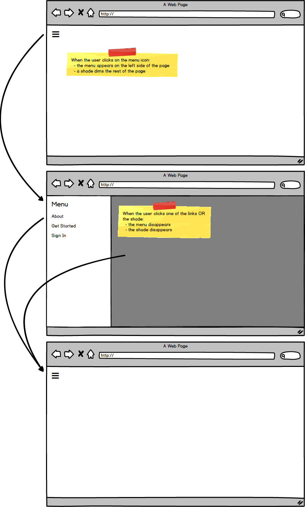

# react-app-drawer-component

Using React to build a dynamic application menu.

### Before You Begin

Be sure to check out a new branch (from `master`) for this exercise. Detailed instructions can be found [**here**](../../guides/before-each-exercise.md). Then navigate to the `exercises/react-app-drawer-component` directory in your terminal.

### Challenge

Use React and CSS to create an `AppDrawer` component that can be toggled open and closed.

### Project Structure

```shell
react-app-drawer-component/
├── dist
│   ├── index.html
│   └── styles.css
├── package.json
├── src
│   ├── index.jsx
│   └── app-drawer.jsx
└── webpack.config.js
```

### Mockup

<p align="center">
  
</p>

### References

- [Thinking in React](https://reactjs.org/docs/thinking-in-react.html)
- [Font Awesome Icons](https://fontawesome.com/icons?d=gallery) - (CSS link [here](https://cdnjs.cloudflare.com/ajax/libs/font-awesome/5.9.0/css/all.css))
- [State and Lifecycle](https://reactjs.org/docs/state-and-lifecycle.html)
- [Lifting State Up](https://reactjs.org/docs/lifting-state-up.html)

### Submitting Your Solution

When your solution is complete, return to the root of your `lfz-full-stack-lessons` directory. Then commit your changes, push, and submit a Pull Request on GitHub. Detailed instructions can be found [**here**](../../guides/after-each-exercise.md).
