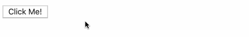

# react-events-and-state

Updating state with events in React.

### Before You Begin

Be sure to check out a new branch (from `master`) for this exercise. Detailed instructions can be found [**here**](../../guides/before-each-exercise.md). Then navigate to the `exercises/react-events-and-state` directory in your terminal.

### Exercise


1. Set up a basic React project with `npm` including `react`, `webpack`, `babel`, a `"build"` script, etc.
1. Create `src/index.jsx` and `dist/index.html`, etc.
1. Add a `webpack.config.js`.
    ```js
    module.exports = {
      resolve: {
        extensions: ['.js', '.jsx']
      },
      module: {
        rules: [
          {
            test: /\.jsx?$/,
            use: {
              loader: 'babel-loader',
              options: {
                plugins: [
                  '@babel/plugin-transform-react-jsx'
                ]
              }
            }
          }
        ]
      }
    };
    ```
1. Read about [Handling Events](https://reactjs.org/docs/handling-events.html) in the official React documentation.
- Bookmark React's [lifecycle diagram](http://projects.wojtekmaj.pl/react-lifecycle-methods-diagram/).
1. Read about [State and Lifecycle](https://reactjs.org/docs/state-and-lifecycle.html) in the official React documentation.
1. In `src/index.jsx` define a class component named `CustomButton` that renders a `<button>` - mount it to the DOM using `ReactDOM.render`.
1. Build your code, then test it by opening `dist/index.html` in the browser.
1. In your class component's constructor, set an [initial `state`](https://reactjs.org/docs/state-and-lifecycle.html#adding-local-state-to-a-class) of `{ isClicked: false }`
1. Read about [Conditional Rendering](https://reactjs.org/docs/conditional-rendering.html) in the official React documentation.
1. Add a method to your class component named `handleClick` that uses `this.setState` to update `isClicked` to `true`.
1. In your component's `render` method, render a different `<button>` depending on whether or not the component has been clicked (`this.state.isClicked`).
1. Be sure to pass your `handleClick` to the `<button>`'s `onClick` prop.



#### Tip!

- Don't forget to [bind](https://developer.mozilla.org/en-US/docs/Web/JavaScript/Reference/Global_objects/Function/bind) your event handler!

### Submitting Your Solution

When your solution is complete, return to the root of your `lfz-full-stack-lessons` directory. Then commit your changes, push, and submit a Pull Request on GitHub. Detailed instructions can be found [**here**](../../guides/after-each-exercise.md).

### Quiz

- What is the purpose of state in React?
- How to you pass an event handler to a React element?
