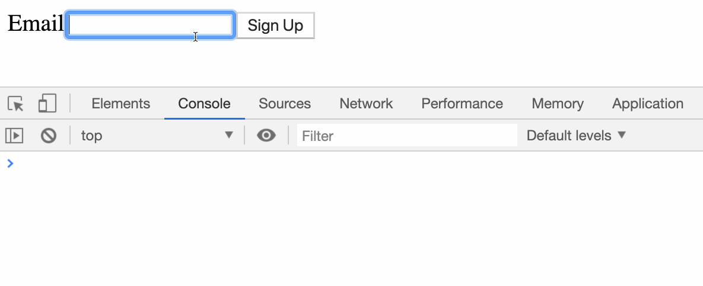

# react-form-controls

Building forms with React.

### Before You Begin

Be sure to check out a new branch (from `master`) for this exercise. Detailed instructions can be found [**here**](../../guides/before-each-exercise.md). Then navigate to the `exercises/react-form-controls` directory in your terminal.

### Exercise

1. Set up a basic React project with the required dependencies and a `"build"` script.
    ```shell
    ├── dist
    │   └── index.html
    ├── package.json
    ├── src
    │   └── index.jsx
    └── webpack.config.js
    ```
2. In `src/index.jsx`, create a class component named `NewsletterForm` that renders a `<form>` containing one `<input>` for an email address and a `<button>`.
3. Read about [Forms](https://reactjs.org/docs/forms.html) in the official React documentation.
4. Define `handleChange` and `handleSubmit` methods on your class component.
    - `handleChange` should update the component's state each time the email `<input>` changes.
    - `handleSubmit` should [prevent the default form submission](https://developer.mozilla.org/en-US/docs/Web/API/Event/preventDefault) behavior and log the component's state to the console.
5. Pass `handleChange` to the `<input>`'s `onChange` prop and `handleSubmit` to the `<form>`'s `onSubmit` prop.
6. Build your code and test it in the browser.



### Submitting Your Solution

When your solution is complete, return to the root of your `lfz-full-stack-lessons` directory. Then commit your changes, push, and submit a Pull Request on GitHub. Detailed instructions can be found [**here**](../../guides/after-each-exercise.md).

### Quiz

- What are controlled components and how do you work with them?
