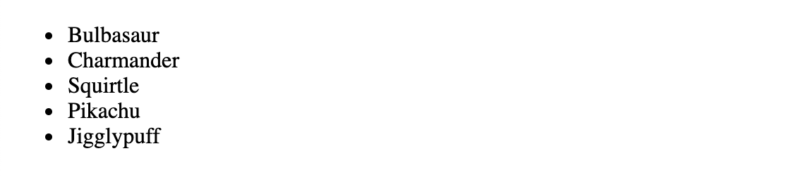

# react-rendering-lists

A short description of the activity in the exercise.

### Before You Begin

Be sure to check out a new branch (from `master`) for this exercise. Detailed instructions can be found [**here**](../../guides/before-each-exercise.md). Then navigate to the `exercises/react-rendering-lists` directory in your terminal.

### Exercise

1. Create a basic React project with the appropriate setup:
    - a new `package.json`
    - required dependencies, including `react`, `webpack`, `babel`, etc
    - `src/index.jsx`
    - `dist/index.html`
    - a `"build"` script
    - the following `webpack.config.js`
      ```js
      module.exports = {
        resolve: {
          extensions: ['.js', '.jsx']
        },
        module: {
          rules: [
            {
              test: /\.jsx?$/,
              use: {
                loader: 'babel-loader',
                options: {
                  plugins: [
                    '@babel/plugin-transform-react-jsx'
                  ]
                }
              }
            }
          ]
        }
      };
      ```
2. Read about [Lists and Keys](https://reactjs.org/docs/lists-and-keys.html) in the official React documentation.
3. Import `React` and `ReactDOM` into `index.jsx` and add the following `Array` of pokémon.
    ```js
    const pokedex = [
      { number: '001', name: 'Bulbasaur' },
      { number: '004', name: 'Charmander' },
      { number: '007', name: 'Squirtle' },
      { number: '025', name: 'Pikachu' },
      { number: '039', name: 'Jigglypuff' }
    ];
    ```
4. Render a `ul` of pokémon to the DOM using `React` and `ReactDOM`.
5. Open `dist/index.html` in your browser to see your list.
    
6. **Note:** Webpack does not automatically recompile your JSX code. You must re-run your `"build"` script to create a new `main.js` (or add an NPM script named `watch` that runs `webpack --watch`).

### Submitting Your Solution

When your solution is complete, return to the root of your `lfz-full-stack-lessons` directory. Then commit your changes, push, and submit a Pull Request on GitHub. Detailed instructions can be found [**here**](../../guides/after-each-exercise.md).

### Quiz

- What `Array` method is commonly used to create a list of React elements?
- What is the best value to use as a "key" prop when rendering lists?
