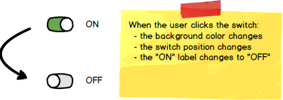

# react-toggle-switch-component

Using React to build a Toggle Switch component.

### Before You Begin

Be sure to check out a new branch (from `master`) for this exercise. Detailed instructions can be found [**here**](../../guides/before-each-exercise.md). Then navigate to the `exercises/react-toggle-switch-component` directory in your terminal.

### Challenge

Use React and CSS to create a `ToggleSwitch` component that toggles between "ON" and "OFF" when a user clicks it.

### Project Structure

```shell
react-toggle-switch-component/
├── dist
│   ├── index.html
│   └── styles.css
├── package.json
├── src
│   ├── index.jsx
│   └── toggle-switch.jsx
└── webpack.config.js
```

### Mockup

<p align="center">
  
</p>

### References

- [Introducing JSX](https://reactjs.org/docs/introducing-jsx.html)
- [Rendering Elements](https://reactjs.org/docs/rendering-elements.html)
- [State and Lifecycle](https://reactjs.org/docs/state-and-lifecycle.html)

### Submitting Your Solution

When your solution is complete, return to the root of your `lfz-full-stack-lessons` directory. Then commit your changes, push, and submit a Pull Request on GitHub. Detailed instructions can be found [**here**](../../guides/after-each-exercise.md).
